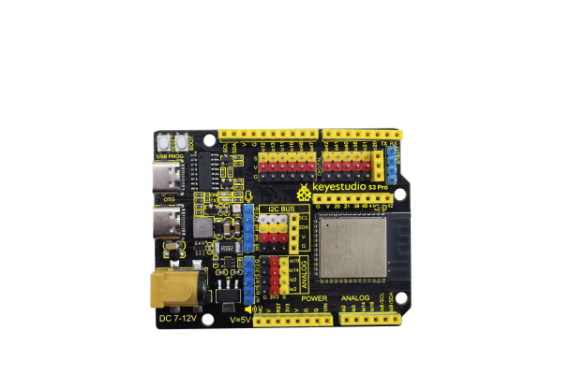
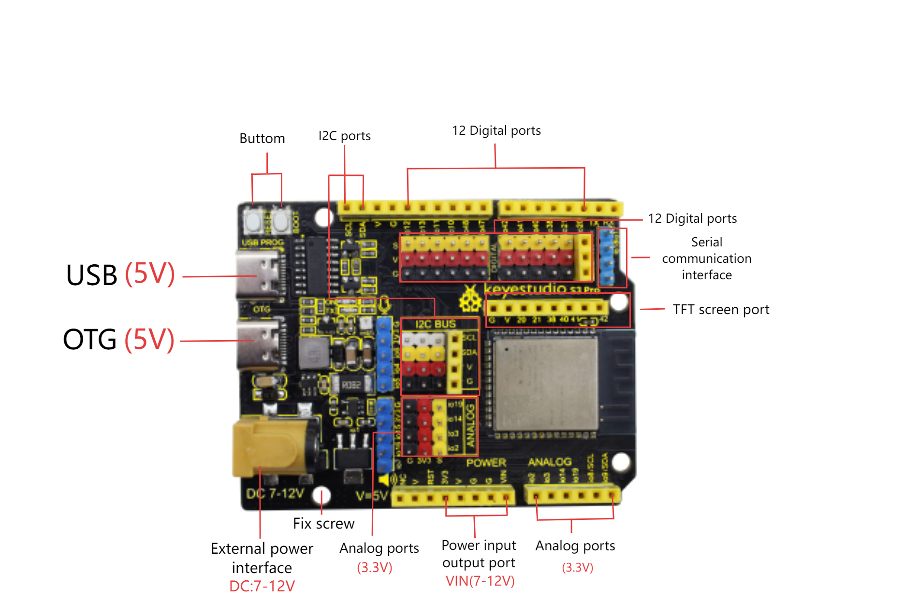
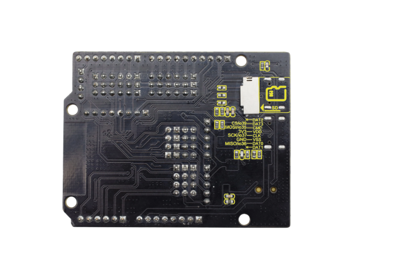
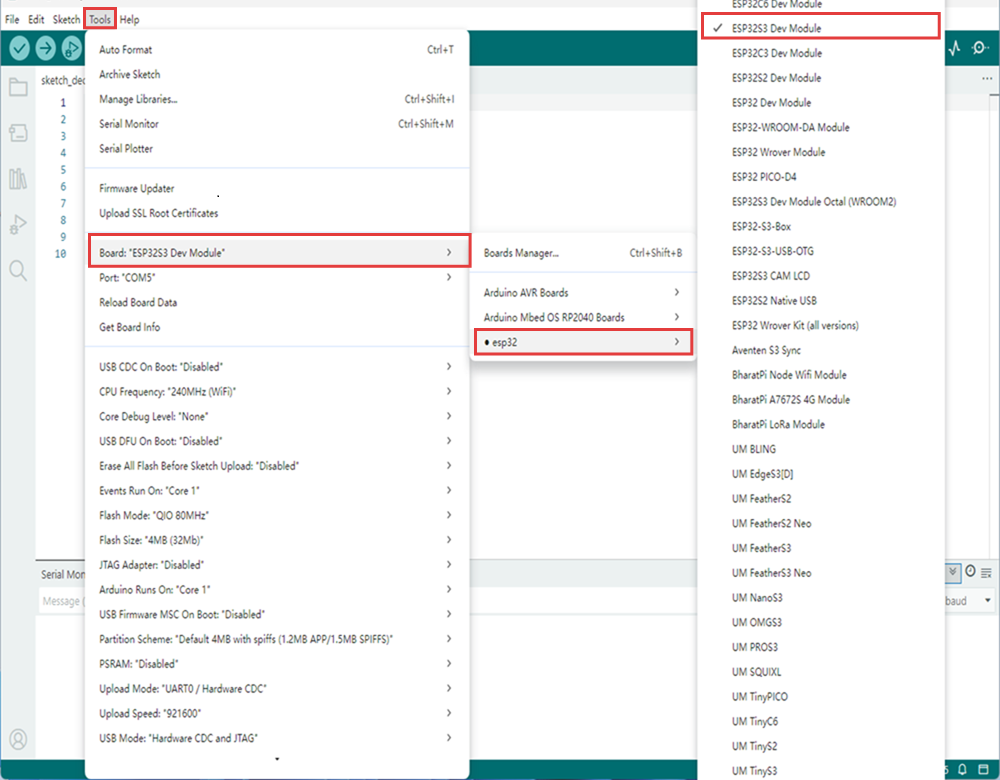
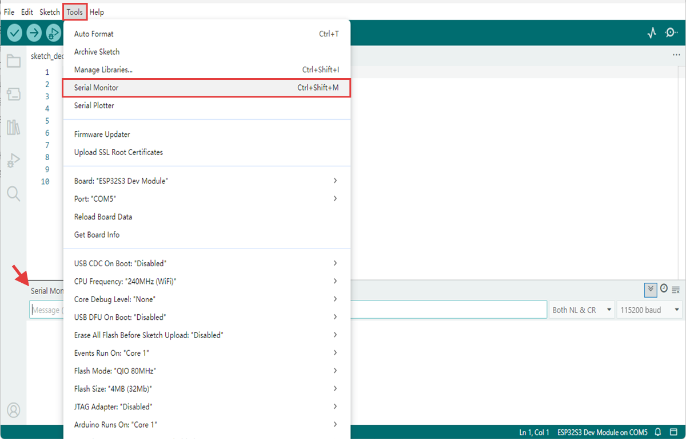
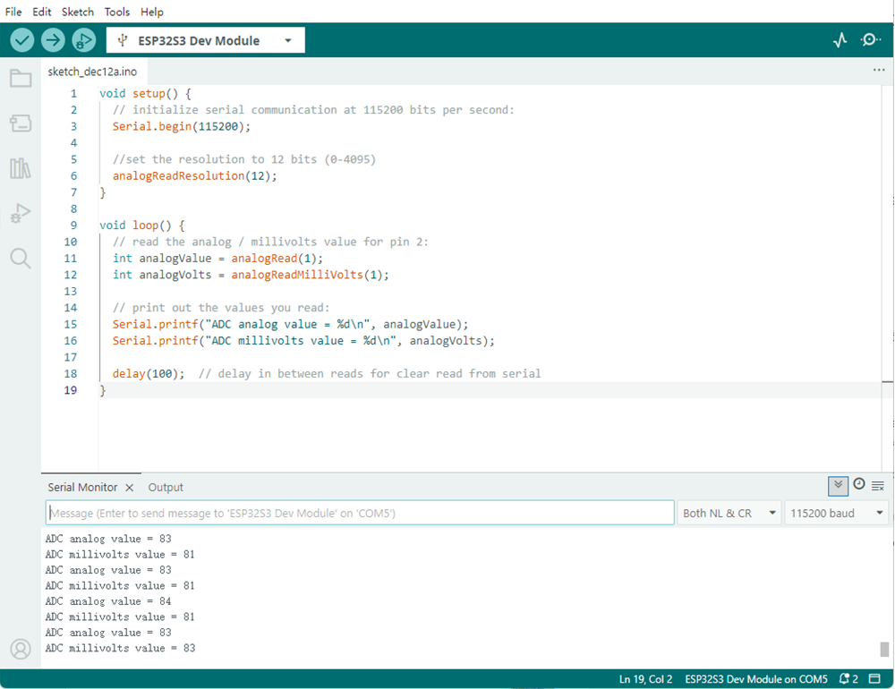
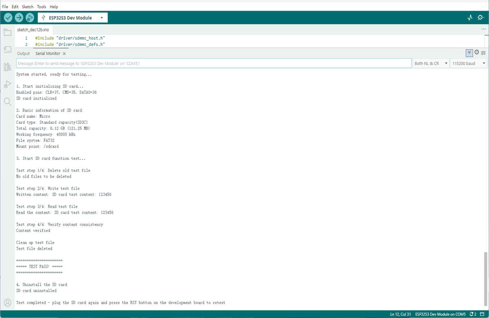

# KS5034 Keystudio ESP32 S3 Pro Development Board



## 1. 介绍

ESP32S3 PRO开发板是基于ESP32-S3-N16R8模组设计的，这款开发板与常见开发板相比增加了电流检测和SD卡挂载功能，并且将绝大多数引脚通过排针排母引出，板载的DC-DC芯片和LDO芯片能够满足常见模组的电源需求，方便开发者拓展额外功能。

## 2. 规格参数
**工作电压**：DC3.3V，DC5V
**输入电压**：DC接口7-12V，USB接口5V
**空载运行电流**：80mA
**最大输出电流**：1.5A
**模组**：ESP32-S3-WROOM-1
**FLASH**：16MB
**时钟频率**：240MHz
**SD卡**：支持 MicroSD/TF 形态
**尺寸**：69mm*54mm

## 3. 接口描述



具体引脚功能可以参考[ESP32-S3 Series Datasheet](https://documentation.espressif.com/esp32-s3_datasheet_en.pdf)2.2章节Pin Overview。
开发板外设与引脚连接如下：
| 外设 | 名称 | IO |   
|:-------:|:----:|:---:|
| RGB     | DIN  | io45      | 
| INA180  | OUT  | io1       | 
| SD卡 | DAT3 | io39/CS   | 
| SD卡 | CMD  | io35/MOSI | 
| SD卡 | SCK  | io37/SCK  | 
| SD卡 | DAT0 | io36/MISO |
| USB OTG | D+   | io20 |
| USB OTG | D-   | io19 |

## 4. Arduino

Arduino IDE安装请参考: [Arduino IDE](https://docs.keyestudio.com/projects/Arduino/en/latest/Arduino%20IDE%20Tutorial.html#download-arduino-ide)
ESP32芯片包安装请参考： [ESP32](https://docs.keyestudio.com/projects/Arduino/en/latest/win-ESP32.html)
请仔细阅读以上参考链接。
### 下载
在上述 Arduino IDE 安装教程中，已包含 ESP32 芯片包（可直装最新版）的详细步骤，此处不再赘述。
启动 IDE 后，依次点击「TOOLS → Board → esp32 → ESP32S3 Dev Module」；端口请选择插上 USB 线后新增的那个串口号。若未出现新端口，请先确认 [CH340驱动](https://docs.keyestudio.com/projects/Arduino/en/latest/windowsCH340.html?highlight=ch340https://docs.keyestudio.com/projects/Arduino/en/latest/windowsCH340.html?highlight=ch340) 是否已安装，或换一条 USB 线再试。


**如何打开串口监视器？**
启动 IDE 后，依次点击「Tools → Serial Monitor」或者直接使用快捷键Ctrl+Shift+M，就可以在IDE下方显示串口监视器了。


### RGB示例
复制以下代码，点击Upload
```
void setup() {
  // No need to initialize the RGB LED
}

// the loop function runs over and over again forever
void loop() {
#ifdef RGB_BUILTIN

  rgbLedWrite(45, RGB_BRIGHTNESS, 0, 0);  // Red
  delay(1000);
  rgbLedWrite(45, 0, RGB_BRIGHTNESS, 0);  // Green
  delay(1000);
  rgbLedWrite(45, 0, 0, RGB_BRIGHTNESS);  // Blue
  delay(1000);
  rgbLedWrite(45, 0, 0, 0);  // Off / black
  delay(1000);
#endif
}
```
烧录成功后，板载RGB会按照1秒的间隔依次发出红绿蓝三种光，最后熄灭如此反复循环。

### INA180电流检测示例
复制以下代码，点击Upload
```
void setup() {
  // initialize serial communication at 115200 bits per second:
  Serial.begin(115200);

  //set the resolution to 12 bits (0-4095)
  analogReadResolution(12);
}

void loop() {
  // read the analog / millivolts value for pin 1:
  int analogValue = analogRead(1);
  int analogVolts = analogReadMilliVolts(1);

  // print out the values you read:
  Serial.printf("ADC analog value = %d\n", analogValue);
  Serial.printf("ADC millivolts value = %d\n", analogVolts);

  delay(100);  // delay in between reads for clear read from serial
}
```
烧录成功后打开串口监视器，就可以看见ESP32S3PRO开发板在空载时io1引脚的读数了。


### SD卡挂载示例
复制以下代码，点击Upload
```
#include "driver/sdmmc_host.h"
#include "driver/sdmmc_defs.h"
#include "esp_vfs_fat.h"
#include "sdmmc_cmd.h"
#include <stdio.h>
#include <string.h>
#include <unistd.h>

// SDIO pin definition - SDIO pins of ESP32-S3
#define SD_CLK_PIN GPIO_NUM_37  // SD card clock
#define SD_CMD_PIN GPIO_NUM_35  // SD card command
#define SD_D0_PIN  GPIO_NUM_36  // SD card data cable 0

// Global variable
bool sdCardAvailable = false;
sdmmc_card_t* sdCard = nullptr; 

// Function declaration
bool initSDCard();
bool testSDCard();
void printSDCardInfo();
void printTestResult(bool result);
void unmountSDCard();
void runTestCycle();

void setup() {
  // Initialize the serial port
  Serial.begin(115200);
  
  // Wait for the serial port to be ready
  while (!Serial) {
    usleep(100000); // Wait for 0.1 seconds
  }
  
  Serial.println("=== SD card offline testing system ===");
  Serial.println("System started, ready for testing...\n");
  
  // Run the initial test
  runTestCycle();
  
  // Prompt the user to retest
  Serial.println("\nTest completed - plug the SD card again and press the RST button on the development board to retest");
}

void loop() {
  // The main loop remains idle and does not perform any operations
  delay(1000);
}

// Complete testing process
void runTestCycle() {
  // Initialize the SD card
  Serial.println("1. Start initializing SD card...");
  sdCardAvailable = initSDCard();
  
  if (sdCardAvailable) {
    // Print the basic information of the SD card
    Serial.println("\n2. Basic information of SD card:");
    printSDCardInfo();
    
    // Perform the SD card test
    Serial.println("\n3. Start SD card function test...");
    bool testResult = testSDCard();
    
    // Print the test results
    printTestResult(testResult);
    
    // Uninstall the SD card (release resources)
    Serial.println("\n4. Uninstall the SD card");
    unmountSDCard();
  } else {
    Serial.println("\nInitialization failed, testing cannot be conducted");
  }
}

// Initialize the SD card - SDMMC mode
bool initSDCard() {
  Serial.printf("Enabled pins: CLK=%d, CMD=%d, DATA0=%d\n", 
                SD_CLK_PIN, SD_CMD_PIN, SD_D0_PIN);

  // Configure the SDMMC host
  sdmmc_host_t host = SDMMC_HOST_DEFAULT();
  host.max_freq_khz = SDMMC_FREQ_HIGHSPEED;
  
  // Configure the SDMMC slot
  sdmmc_slot_config_t slot_config = SDMMC_SLOT_CONFIG_DEFAULT();
  slot_config.clk = (gpio_num_t)SD_CLK_PIN;
  slot_config.cmd = (gpio_num_t)SD_CMD_PIN;
  slot_config.d0 = (gpio_num_t)SD_D0_PIN;
  slot_config.width = 1;  // 1-bit mode
  
  // Mounting failed
  esp_vfs_fat_sdmmc_mount_config_t mount_config = {
    .format_if_mount_failed = false,
    .max_files = 5,
    .allocation_unit_size = 16 * 1024
  };
  
  esp_err_t ret = esp_vfs_fat_sdmmc_mount("/sdcard", &host, &slot_config, &mount_config, &sdCard);
  
  if (ret != ESP_OK) {
    Serial.printf("SDMMC mounting failed: 0x%x - %s\n", ret, esp_err_to_name(ret));
    
    // Try formatting
    Serial.println("Try formatting SD card...");
    mount_config.format_if_mount_failed = true;
    ret = esp_vfs_fat_sdmmc_mount("/sdcard", &host, &slot_config, &mount_config, &sdCard);
    
    if (ret != ESP_OK) {
      Serial.printf("Formatting failed.: 0x%x - %s\n", ret, esp_err_to_name(ret));
      return false;
    }
  }
  
  Serial.println("SD card initialized");
  return true;
}

  // SD card test function
bool testSDCard() {
  if (!sdCardAvailable) return false;
  
  String testPath = "/sdcard/test.txt";
  bool testPassed = true;
  
  // 1. Delete any possible old test files
  Serial.println("\nTest step 1/4: Delete old test file");
  if (remove(testPath.c_str()) != 0) {
    if (errno != ENOENT) {  // ENOENT indicates that the file does not exist, which is a normal situation
      Serial.printf("Deletion failed: %s\n", strerror(errno));
      testPassed = false;
    } else {
      Serial.println("No old files to be deleted");
    }
  } else {
    Serial.println("Old file deleted");
  }
  
  // 2. Write the test file
  Serial.println("\nTest step 2/4: Write test file");
  FILE* file = fopen(testPath.c_str(), "w");
  if (!file) {
    Serial.println("Write failed: Unable to create file");
    return false;
  }
  
  const char* testContent = "SD card test content: 123456";
  fprintf(file, "%s", testContent);
  fclose(file);
  Serial.printf("Written content: %s\n", testContent);
  
  // 3. Read the test file
  Serial.println("\nTest step 3/4: Read test file");
  file = fopen(testPath.c_str(), "r");
  if (!file) {
    Serial.println("Read failed: Unable to open file");
    return false;
  }
  
  char content[100] = {0};
  fread(content, 1, sizeof(content)-1, file);
  fclose(file);
  
  // Remove possible line breaks
  String contentStr = String(content);
  contentStr.trim();
  Serial.printf("Read the content: %s\n", contentStr.c_str());
  
  // 4. Verify content
  Serial.println("\nTest step 4/4: Verify content consistency");
  if (contentStr != testContent) {
    Serial.println("Content verification failed: Expectations do not match reality");
    testPassed = false;
  } else {
    Serial.println("Content verified");
  }
  
  // Clean up the test file
  Serial.println("\nClean up test file");
  if (remove(testPath.c_str()) != 0) {
    Serial.printf("Test file deletion failed: %s\n", strerror(errno));
    // Deletion failure is not regarded as a test failure
  } else {
    Serial.println("Test file deleted");
  }
  
  return testPassed;
}

// Print the SD card information
void printSDCardInfo() {
  if (!sdCardAvailable) return;
  
  // Card name
  Serial.printf("Card name: %s\n", sdCard->cid.name);
  
  // Card type
  Serial.print("Card type: ");
  if (sdCard->ocr & 0x40000000) {
    Serial.println("High capacity(SDHC)/Expanded capacity(SDXC)");
  } else {
    Serial.println("Standard capacity(SDSC)");
  }
  
  // Capacity information
  uint64_t cardSize = (uint64_t)sdCard->csd.capacity * sdCard->csd.sector_size;
  Serial.printf("Total capacity: %.2f GB (%.2f MB)\n", 
                (float)cardSize / (1024 * 1024 * 1024),
                (float)cardSize / (1024 * 1024));
  
  // Working frequency
  Serial.printf("Working frequency: %d kHz\n", sdCard->max_freq_khz);
  
  // File system
  Serial.println("File system: FAT32");
  Serial.println("Mount point: /sdcard");
}

// Print the test results
void printTestResult(bool result) {
  Serial.println("\n======================");
  if (result) {
    Serial.println("===== TEST PASS! =====");
  } else {
    Serial.println("===== TEST FAILED! =====");
  }
  Serial.println("======================");
}

// Uninstall the SD card
void unmountSDCard() {
  if (sdCardAvailable) {
    esp_vfs_fat_sdmmc_unmount();
    sdCardAvailable = false;
    Serial.println("SD card uninstalled");
  }
}
```
烧录成功后，打开串口监视器，按下开发板上的RESET按键，可以看到串口打印出如下信息。



## 5. 注意事项

1.请勿直接使用IO口直接接入大功率电机。
2.请勿将电源与地短接。
3.电流检测在空载时误差较大。